# Three-Tank Process Automation — Siemens TIA Portal V20

   

This repository documents the TIA Portal version of my three-tank process controller. The process is deliberately simple — fill T101, transfer to T102, then transfer to T103 — so the engineering work is visible in the controller itself: explicit state ownership, structured UDT/DB interfaces, equipment feedback supervision, first-out diagnostics, deterministic process simulation, WinCC Unified, distributed I/O, drive integration and structured FAT evidence.

The TIA version was redesigned rather than translated block-for-block from CODESYS. Sequence ownership, I/O boundaries, simulation timing, equipment supervision and diagnostics were separated so the control path can be traced from an operator request to the final mapped output.

<p align="center">
  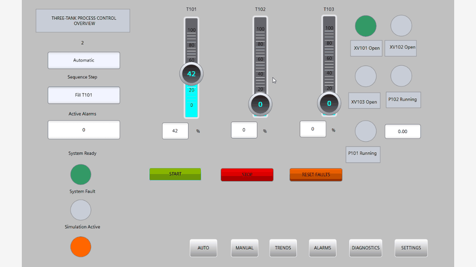
</p>

### Automatic cycle demonstration


https://github.com/user-attachments/assets/04234072-e123-479f-b864-2cfa0d33f575


**Engineering stack:** `TIA Portal V20` · `CPU 1511C-1 PN` · `WinCC Unified` · `LAD/FBD/SCL` · `UDT/FB/FC/DB architecture` · `ET 200SP` · `PROFINET` · `PROFIBUS DP` · `SINAMICS G120C` · `Startdrive` · `SinaSpeed` · `OPC UA` · `PLCSIM` · `FAT`

**Quick access:** [FAT report](docs/ThreeTank_FAT_Validation_Report.pdf) · [Architecture](docs/ARCHITECTURE.md) · [Traceability](docs/ENGINEERING_TRACEABILITY.md) · [Block reference](docs/PLC_BLOCK_REFERENCE.md) · [Source excerpts](plc-excerpts/README.md) · [PLCSIM guide](docs/RUNNING_IN_PLCSIM.md) · [TIA archive / latest release](https://github.com/mohammadHamdan96-Eng/ThreeTank-TIA-Automation/releases/latest)

**Jump to:** [Migration](#migration) · [Architecture](#architecture) · [Sequence & permissives](#sequence) · [Diagnostics](#diagnostics) · [HMI & simulation](#hmi) · [Drive & networks](#integration) · [FAT](#fat) · [Archive](#archive)

---

## Engineering snapshot

### Control path and fault response

The same control chain is used for normal operation and fault handling. A command advances the process only after the required feedback and process conditions are proved; otherwise the path branches into diagnostics and the controlled `S90` fault state.

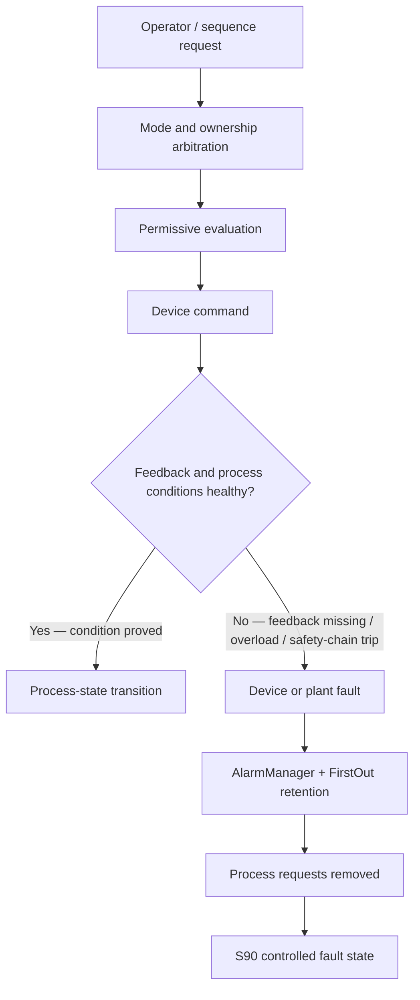
```mermaid
flowchart TD
    A["Operator / sequence request"] --> B["Mode and ownership arbitration"]
    B --> C["Permissive evaluation"]
    C --> D["Device command"]
    D --> E{"Feedback and process conditions healthy?"}
    E -->|"Yes — condition proved"| F["Process-state transition"]
    E -->|"No — feedback missing / overload / safety-chain trip"| G["Device or plant fault"]
    G --> H["AlarmManager + FirstOut retention"]
    H --> I["Process requests removed"]
    I --> J["S90 controlled fault state"]
```

> **Safety note:** `SafetyCircuitOK` / `TripSafetyCircuit` is a simulated standard-PLC plant trip input used to test controlled shutdown and diagnostics; it is not presented as a certified functional-safety function.

Five design rules are used consistently throughout the project:

- **Single ownership of state:** automatic sequence, simulation, alarm memory and final output mapping each have a defined writer.
- **Command is not feedback:** a valve command does not prove the valve is open; a pump command does not prove the pump is running.
- **Interlock before actuation:** transfer pumps are released only after the associated flow path and process conditions are valid.
- **Retain the initiating cause:** device fault codes and first-out information remain available after the controller reacts.
- **Test through the normal control path:** simulated feedback and deliberate fault injection exercise the same equipment and alarm logic used by normal operation.

**Scale:** 3 tanks · 3 valves · 2 pumps · 9 sequence states · 7 WinCC screens · 25 retained FAT records · PROFINET + PROFIBUS DP + OPC UA · G120C drive path

---

<a id="migration"></a>
## 1. From CODESYS prototype to TIA architecture

The original CODESYS project proved the operating concept. The TIA version was used to redesign the parts that become difficult to maintain as a PLC application grows.

The baseline remains available separately: [ThreeTank-CODESYS-WaterTransfer](https://github.com/mohammadHamdan96-Eng/ThreeTank-CODESYS-WaterTransfer).

| Engineering area | CODESYS V1 | TIA Portal V2 |
|---|---|---|
| Sequence ownership | State affected from several logic areas | `FB_AutoSequence` is the single owner |
| Data model | Mostly flat/local variables | Structured UDT interfaces and dedicated DBs |
| I/O path | Simulation and control signals mixed | Input, logical process-output and final mapped-output layers |
| Simulation | Scan-dependent level updates | Fixed-cycle process model |
| Process model | Independent level changes | Mass-balanced tank cascade |
| Equipment logic | Repeated networks | Reusable `FB_Valve` and `FB_Pump` |
| Setpoints | Embedded in logic | Requested / Active configuration model |
| Diagnostics | Individual fault bits | Alarm/trip aggregation + device codes + FirstOut |
| HMI | Single visualization | Purpose-specific WinCC Unified screens |
| Integration | Software-only baseline | PROFINET, ET 200SP, PROFIBUS, G120C, OPC UA |
| Validation | Functional simulation | Structured PLCSIM FAT with retained evidence |

The TIA application is therefore not the old sequence in another IDE. State ownership, device supervision, simulation timing and I/O boundaries were changed deliberately from the CODESYS baseline.

[Migration and design decisions →](docs/MIGRATION_AND_DESIGN_DECISIONS.md)

---

<a id="architecture"></a>
## 2. Architecture, data model and ownership

The controller is built around a **CPU 1511C-1 PN**. The PROFINET side integrates the WinCC HMI, ET 200SP PN station and G120C PN device. A **CM 1542-5** provides the separate PROFIBUS master path to an ET 200SP **IM 155-6 DP HF** station.

<p align="center">
  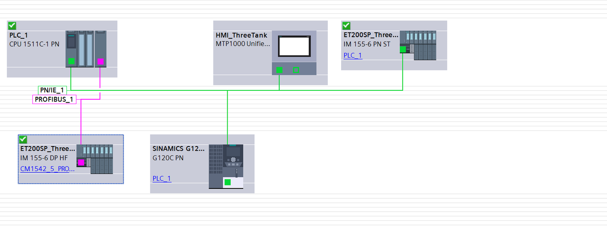
</p>

<table>
<tr>
<td width="50%">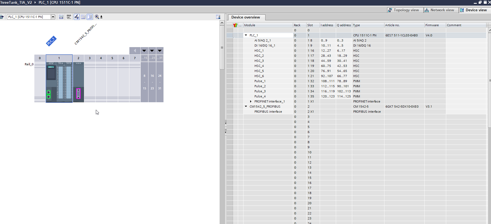</td>
<td width="50%">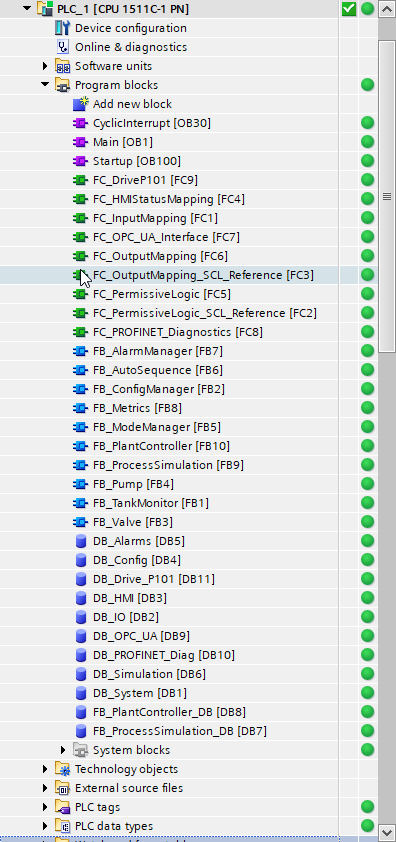</td>
</tr>
<tr>
<td align="center"><em>CPU and PROFIBUS communication module</em></td>
<td align="center"><em>Program organization in TIA Portal</em></td>
</tr>
</table>

### Software ownership

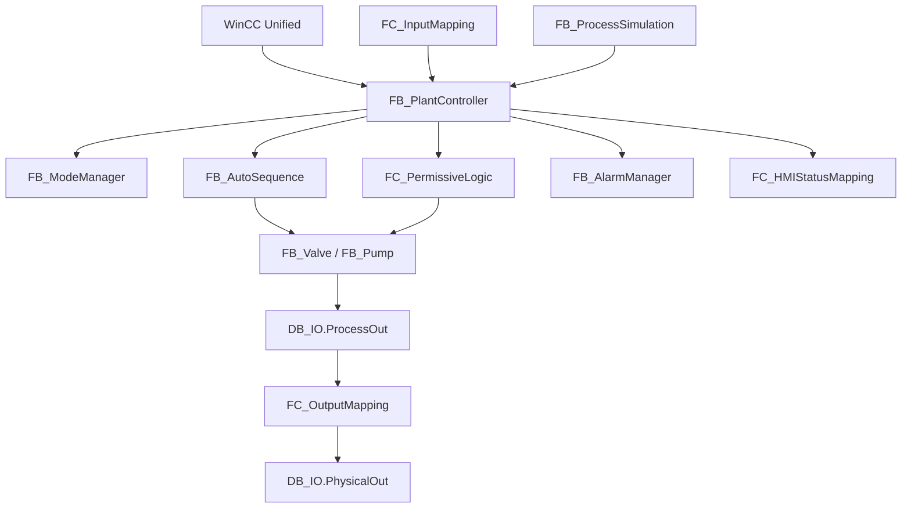
```mermaid
flowchart TD
    HMI[WinCC Unified] --> CTRL[FB_PlantController]
    INPUT[FC_InputMapping] --> CTRL
    CTRL --> MODE[FB_ModeManager]
    CTRL --> SEQ[FB_AutoSequence]
    CTRL --> PERM[FC_PermissiveLogic]
    SEQ --> DEV[FB_Valve / FB_Pump]
    PERM --> DEV
    DEV --> PROC[DB_IO.ProcessOut]
    PROC --> OUT[FC_OutputMapping]
    OUT --> PHY[DB_IO.PhysicalOut]
    SIM[FB_ProcessSimulation] --> CTRL
    CTRL --> ALM[FB_AlarmManager]
    CTRL --> HMIOUT[FC_HMIStatusMapping]
```

The important boundary is between **logical process demand** and **final mapped output**. `DB_IO.ProcessOut` answers what the process controller wants; `FC_OutputMapping` owns the final mapped assignment into `DB_IO.PhysicalOut`.

<table>
<tr>
<td width="50%">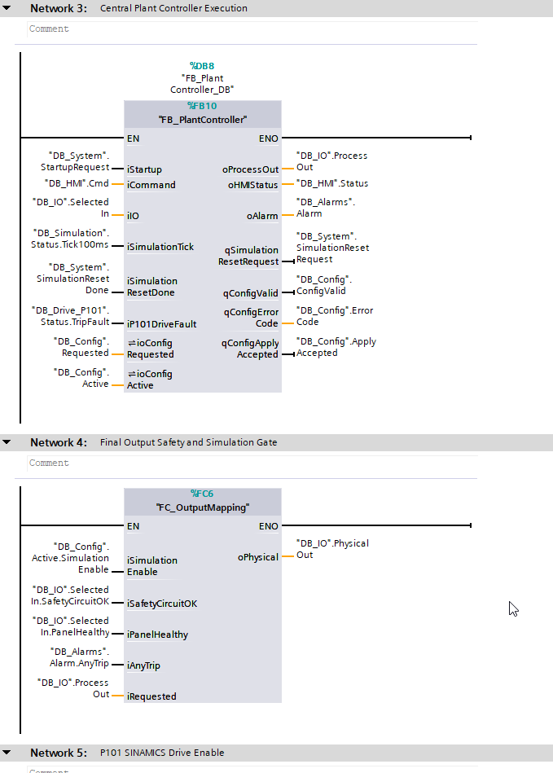</td>
<td width="50%">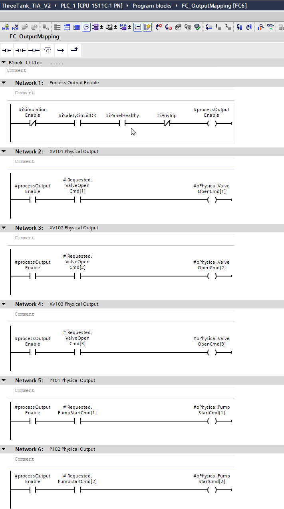</td>
</tr>
</table>

### Structured data

The same ownership idea is used in the DB layer. `DB_System`, `DB_HMI`, `DB_IO`, `DB_Config`, `DB_Alarms`, `DB_Simulation`, `DB_Drive_P101`, `DB_OPC_UA` and `DB_PROFINET_Diag` each have a defined role. Repeated device data is grouped through arrays/UDTs instead of unrelated global tags.

<p align="center">
  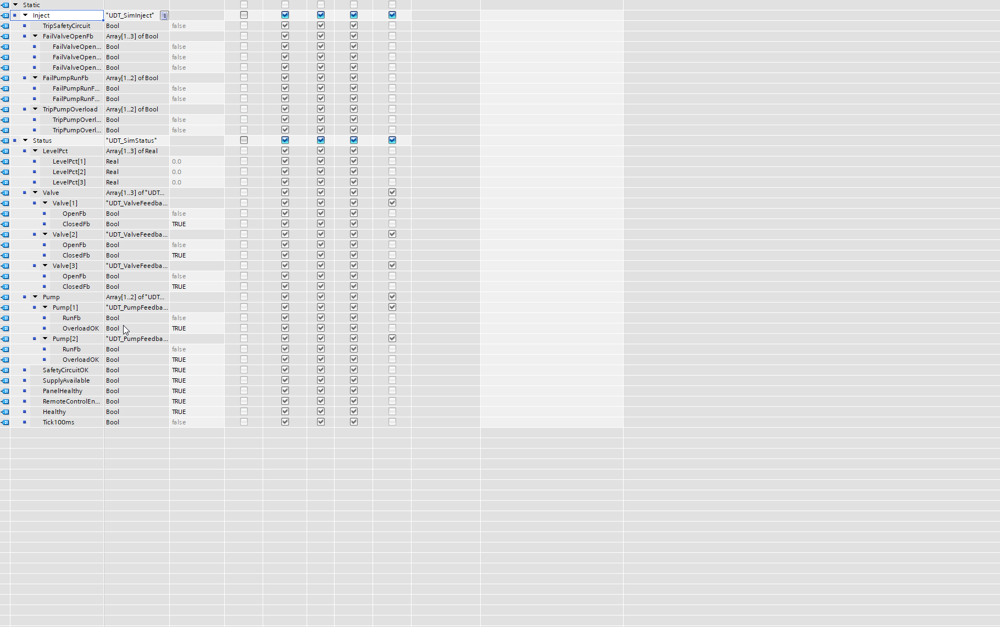
</p>

<details>
<summary><strong>PLC block and DB reference</strong></summary>

### Main blocks

| Block | Responsibility |
|---|---|
| `Main [OB1]` | Cyclic integration and call order |
| `Startup [OB100]` | Startup initialization |
| `CyclicInterrupt [OB30]` | Fixed-time process simulation execution |
| `FB_PlantController [FB10]` | High-level plant coordination |
| `FB_AutoSequence [FB6]` | Sole owner of automatic sequence state |
| `FB_ModeManager [FB5]` | Off / Manual / Auto arbitration |
| `FB_ConfigManager [FB2]` | Requested vs. active configuration |
| `FB_Valve [FB3]` | Reusable valve command/feedback supervision |
| `FB_Pump [FB4]` | Reusable pump command/run-feedback/trip supervision |
| `FB_AlarmManager [FB7]` | Alarm/trip aggregation and FirstOut memory |
| `FB_ProcessSimulation [FB9]` | Process levels, simulated feedback and fault injection |
| `FC_InputMapping [FC1]` | Input abstraction into structured data |
| `FC_HMIStatusMapping [FC4]` | PLC status to WinCC-facing data |
| `FC_PermissiveLogic [FC5]` | Plant/equipment permission calculation |
| `FC_OutputMapping [FC6]` | Final mapped-output assignment |
| `FC_OPC_UA_Interface [FC7]` | External process/status data boundary |
| `FC_PROFINET_Diagnostics [FC8]` | PLC-side network diagnostics path |
| `FC_DriveP101 [FC9]` | G120C / `SinaSpeed` command-status interface |

### Main DB responsibilities

| DB | Responsibility |
|---|---|
| `DB_System` | Controller/system status |
| `DB_HMI` | Operator command/status boundary |
| `DB_IO` | Feedback, process requests and final mapped outputs |
| `DB_Config` | Requested / Active process configuration |
| `DB_Alarms` | Alarm, trip and FirstOut data |
| `DB_Simulation` | Levels, simulated feedback and fault injection |
| `DB_Drive_P101` | P101 drive command/status data |
| `DB_OPC_UA` | External supervisory data model |
| `DB_PROFINET_Diag` | Network diagnostic information |

</details>

[Architecture detail →](docs/ARCHITECTURE.md) · [PLC block reference →](docs/PLC_BLOCK_REFERENCE.md)

---

<a id="sequence"></a>
## 3. Sequence control, equipment supervision and permissives

`FB_AutoSequence` owns the process state. The HMI requests operation; it does not write sequence transitions.

| State | Function | Main action / condition |
|---:|---|---|
| `S0` | Off / Idle | Safe waiting state |
| `S10` | Precheck | Validate mode and start conditions |
| `S20` | Fill T101 | Request XV101 and supervise fill |
| `S30` | T101 ready | Prepare transfer to T102 |
| `S40` | T101 → T102 | Prove XV102, then permit P101 |
| `S50` | T102 ready | Prepare downstream transfer |
| `S60` | T102 → T103 | Prove XV103, then permit P102 |
| `S70` | Complete | Remove process requests and report completion |
| `S90` | Fault | Controlled trip state with process requests removed |

> **State numbering:** `S80` is not used in this implementation. The state identifiers are intentionally non-contiguous; transitions are defined by named constants rather than by numeric incrementing.

### Representative SCL — transition ownership and trip priority

The excerpt below is taken from the implemented `FB_AutoSequence [FB6]`. A trip has priority over normal transitions, while an operator Stop returns a non-faulted sequence to Idle. Startup also requires Auto mode, a start pulse, system readiness and the AutoStart permissive.

```scl
// A trip has priority over normal transitions. Operator Stop is controlled.
IF #iAnyTrip THEN
    #stStep := #cStepFault;
ELSIF #iStopPulse AND (#stStep <> #cStepFault) THEN
    #stStep := #cStepIdle;
ELSE
    CASE #stStep OF
        0:
            IF #iAutoActive
               AND #iStartPulse
               AND #iSystemReady
               AND #iPermissive.AutoStart THEN
                #stStep := #cStepPrecheck;
            END_IF;
```

<p align="center">
  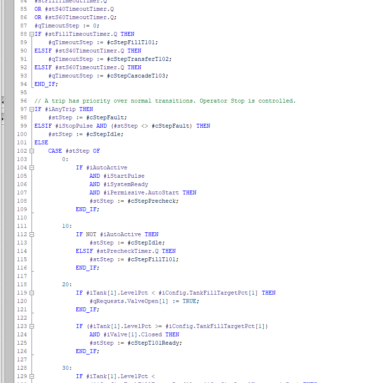
</p>

[Browser-readable SCL excerpt →](plc-excerpts/FB_AutoSequence_trip_priority_excerpt.scl)

<details>
<summary><strong>Full retained AutoSequence implementation views</strong></summary>

<table>
<tr>
<td width="50%">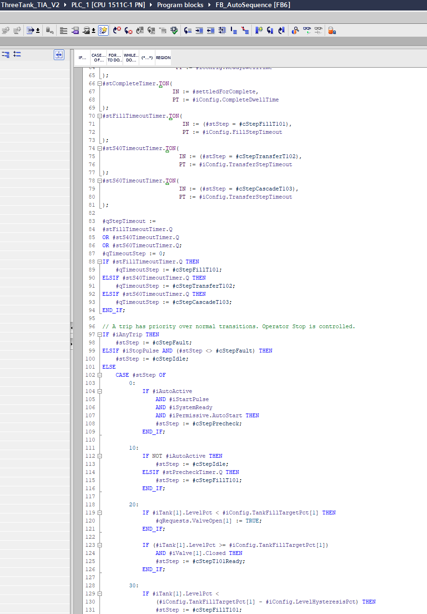</td>
<td width="50%">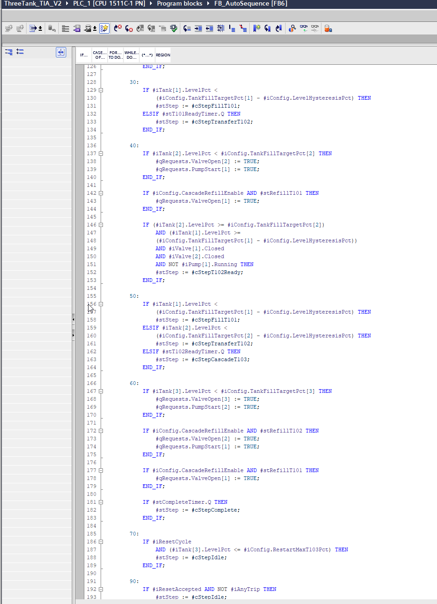</td>
</tr>
</table>

</details>

### Example: S40 transfer path

P101 is not simply turned on because the sequence reached S40.

```text
S40 active
   ↓
XV102 OpenCmd
   ↓
XV102 OpenFb proved
   ↓
plant + process + overload permissives valid
   ↓
P101 StartCmd released
   ↓
P101 RunFb supervised
```

If XV102 feedback is missing, **P101 stays inhibited**. If the feedback supervision expires, the valve fault is passed into the alarm/trip path and the sequence enters S90.

<table>
<tr>
<td width="50%">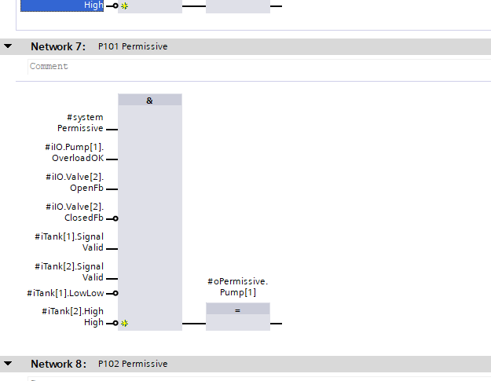</td>
<td width="50%">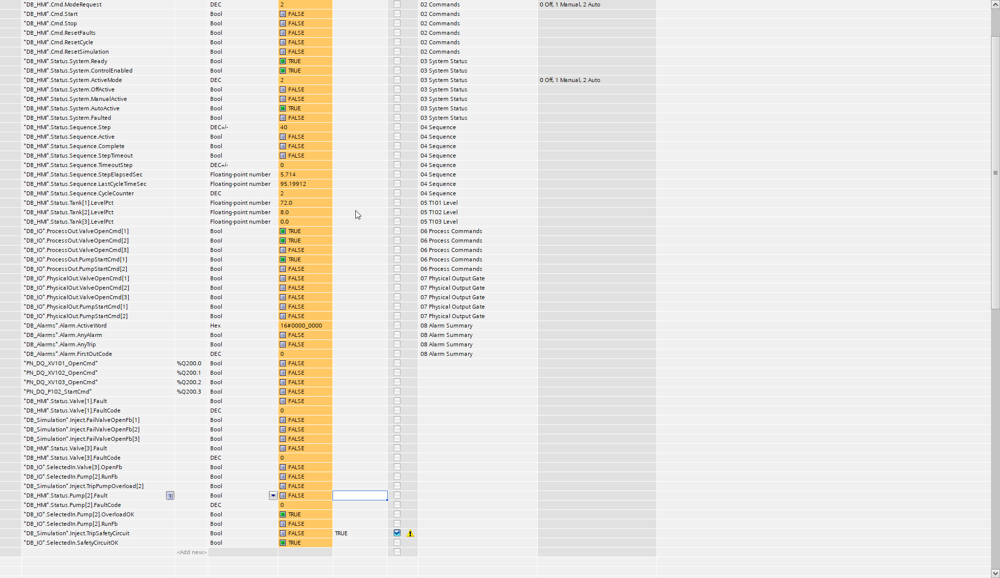</td>
</tr>
<tr>
<td align="center"><em>P101 permissive — path proof before pump release</em></td>
<td align="center"><em>Healthy S40 path after XV102 proof</em></td>
</tr>
</table>

### Manual mode uses the same rules

Manual operation is a commissioning-style command path, not a direct-output bypass. The retained evidence shows both sides of the P101 interlock:

<table>
<tr>
<td width="50%">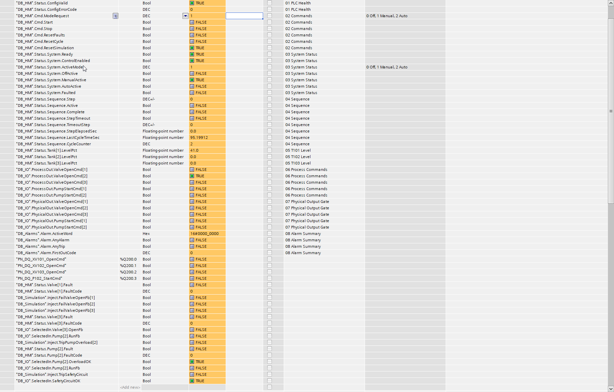</td>
<td width="50%">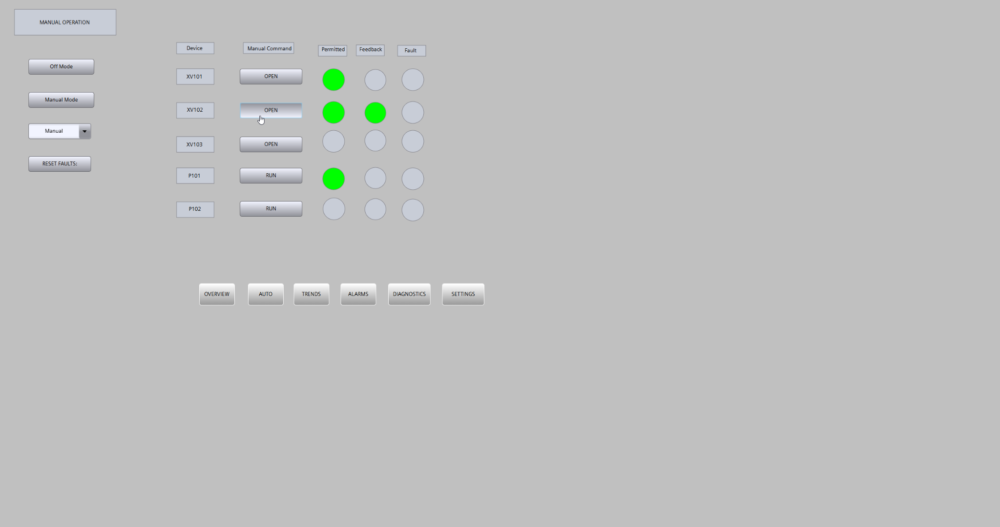</td>
</tr>
<tr>
<td align="center"><em>Before path proof: P101 inhibited</em></td>
<td align="center"><em>After path proof: P101 permission available</em></td>
</tr>
</table>

[Equipment and permissive detail →](docs/EQUIPMENT_AND_DIAGNOSTICS.md)

---

<a id="diagnostics"></a>
## 4. Diagnostics, FirstOut and controlled recovery

A process fault often creates secondary symptoms after the controller reacts. `FB_AlarmManager` therefore retains the **initiating trip source** rather than relying only on a generic active-fault bit.

<p align="center">
  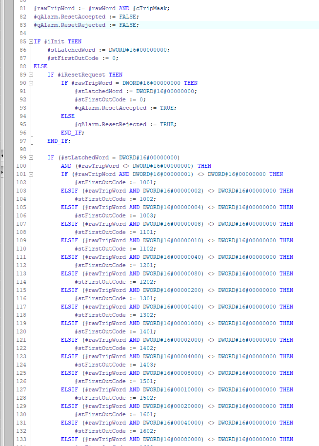
</p>

The reset path only clears the retained alarm state when the raw trip word is clear. FirstOut is assigned when a new trip appears while no earlier trip is latched, preserving the initiating cause instead of whichever secondary alarm happens to remain active later.

[Browser-readable FirstOut excerpt →](plc-excerpts/FB_AlarmManager_firstout_excerpt.scl)

<details>
<summary><strong>Full retained AlarmManager implementation views</strong></summary>

<table>
<tr>
<td width="33%">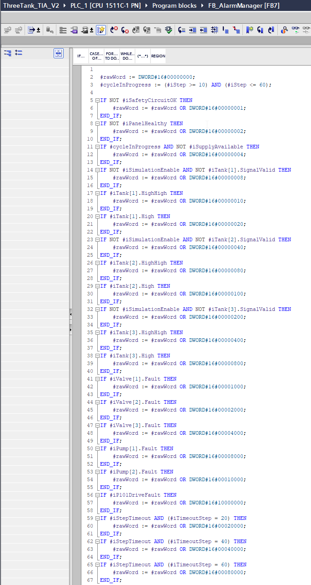</td>
<td width="33%">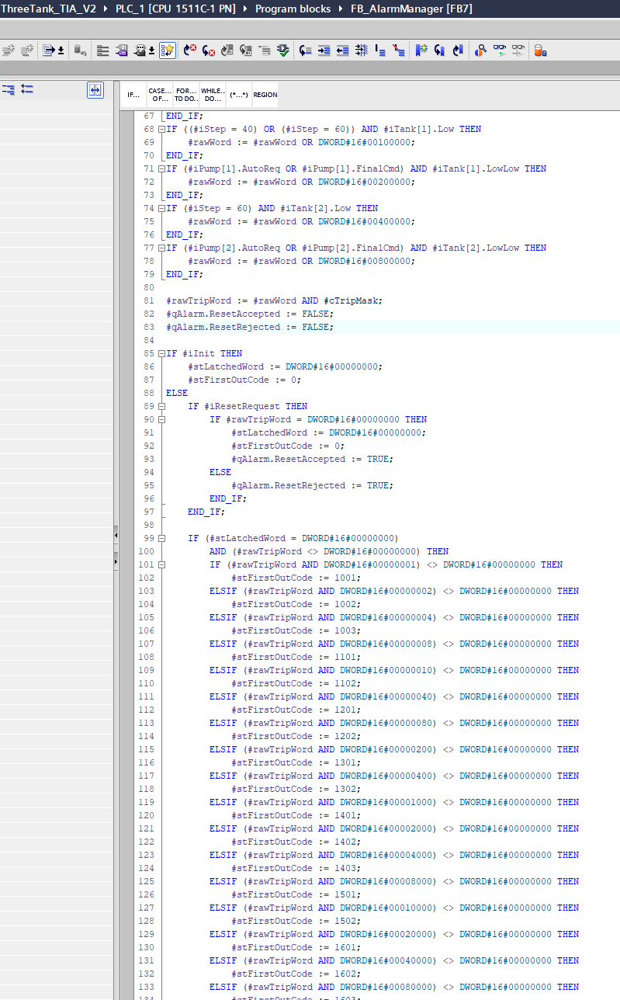</td>
<td width="33%">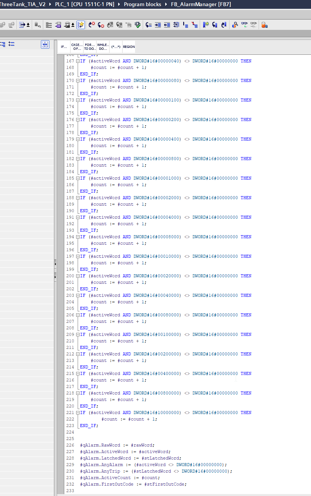</td>
</tr>
</table>

</details>

### Cause and effect

| Initiating condition | Controller response | Retained diagnostic |
|---|---|---|
| Plant safety-chain input unhealthy | Requests removed → S90 | FirstOut `1001` |
| XV101 OpenFb missing | Valve supervision trips → S90 | FirstOut `1401` |
| XV102 OpenFb missing | P101 inhibited; valve supervision trips → S90 | FirstOut `1402` |
| XV103 OpenFb missing | P102 inhibited; valve supervision trips → S90 | FirstOut `1403` |
| P101 RunFb missing | Failed-to-start supervision trips → S90 | FirstOut `1501` |
| P102 overload | P102 demand removed → S90 | FirstOut `1502` |

### XV102 end-to-end trace

```text
S40 request
   ↓
XV102 OpenCmd
   ↓
OpenFb missing
   ↓
valve fault
   ↓
FirstOut 1402
   ↓
S90
   ↓
process requests removed
```

<table>
<tr>
<td width="50%">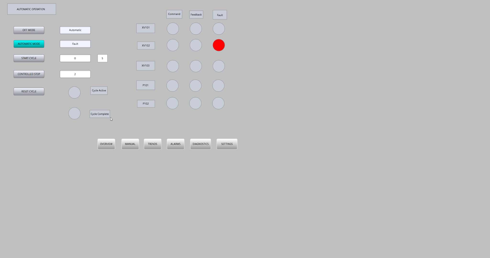</td>
<td width="50%">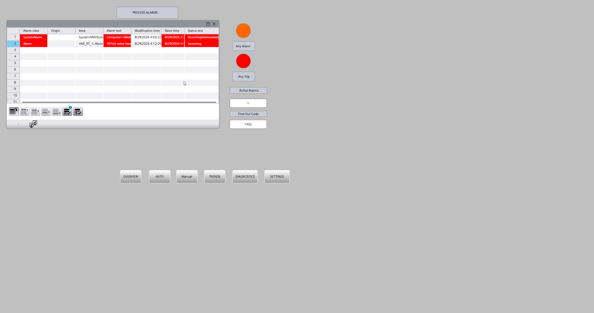</td>
</tr>
</table>

Recovery was tested separately from fault detection: after the initiating condition is cleared and reset is accepted, the controller returns through the defined restart path instead of silently resuming a failed motion/request.

[Full cause-and-effect matrix →](docs/CAUSE_AND_EFFECT_MATRIX.md)

---

<a id="hmi"></a>
## 5. Process simulation and WinCC Unified

The PLC-side simulation exists so normal sequence, device and alarm logic can be exercised without replacing the controller with FAT-specific code.

- one simulation block owns process values and simulated feedback;
- it executes from a fixed **100 ms** time base;
- the tank model is mass-balanced across the transfer path;
- fault injection changes simulated feedback/trip conditions, not the sequence implementation itself.

```text
dT101 = inlet flow - P101 flow
dT102 = P101 flow - P102 flow
dT103 = P102 flow
```

<table>
<tr>
<td width="50%">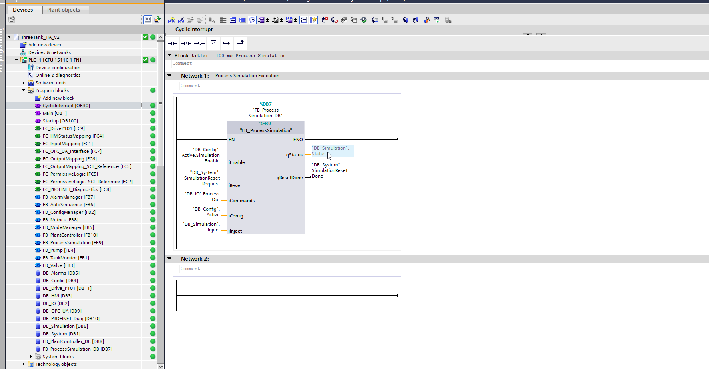</td>
<td width="50%"></td>
</tr>
</table>

### WinCC operator workflow

The HMI is separated by task: **Overview, Automatic, Manual, Alarms, Diagnostics, Trends and Settings**. It provides the operator-facing state while PLC watch tables expose the exact sequence, command, feedback and alarm values behind that state during validation.

<table>
<tr>
<td width="50%">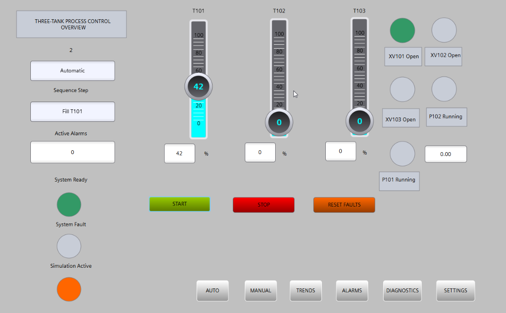</td>
<td width="50%">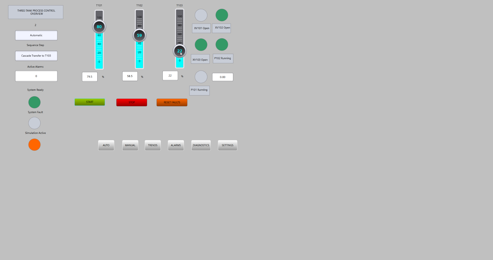</td>
</tr>
<tr>
<td align="center"><em>S20 — T101 fill</em></td>
<td align="center"><em>Downstream cascade — T103 rising</em></td>
</tr>
</table>

<table>
<tr>
<td width="33%">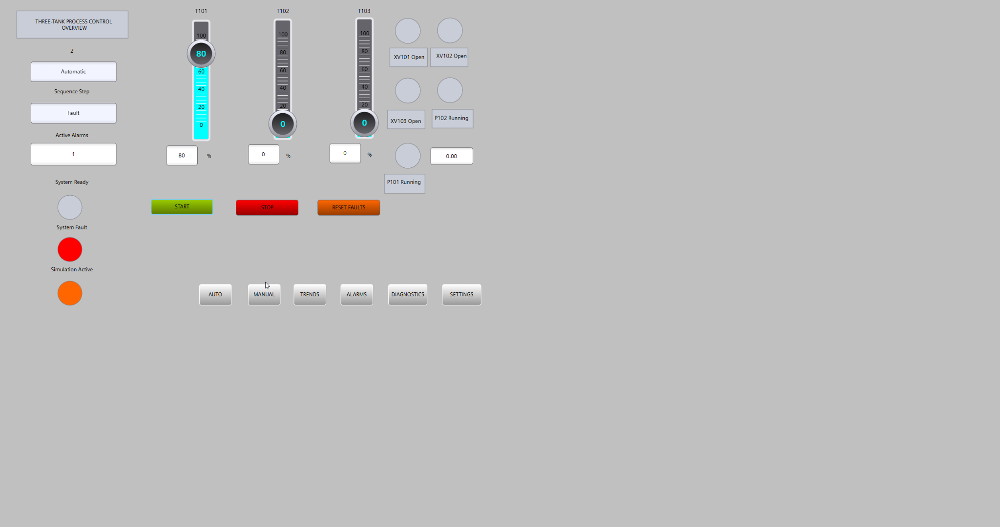</td>
<td width="33%">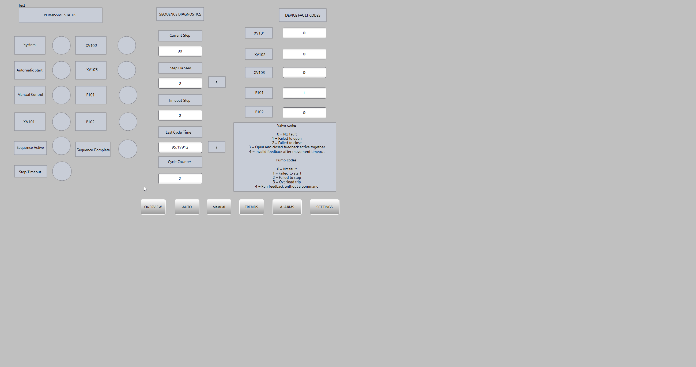</td>
<td width="33%"></td>
</tr>
</table>

<table>
<tr>
<td width="50%">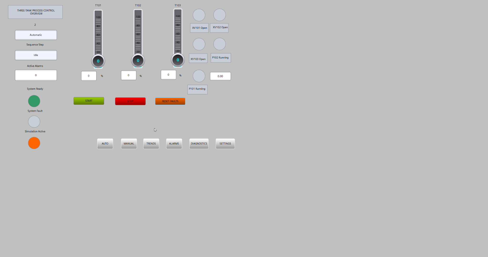</td>
<td width="50%">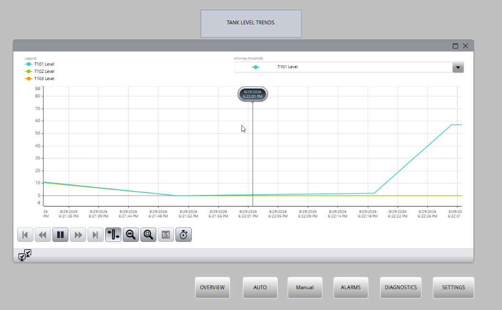</td>
</tr>
<tr>
<td align="center"><em>Controlled recovery</em></td>
<td align="center"><em>Process trend evidence</em></td>
</tr>
</table>

---

<a id="integration"></a>
## 6. Drive and industrial communication

### SINAMICS G120C / `SinaSpeed`

P101 has a dedicated drive abstraction in `FC_DriveP101 [FC9]`. The plant controller works with process-level demand/status rather than interpreting telegram details directly.

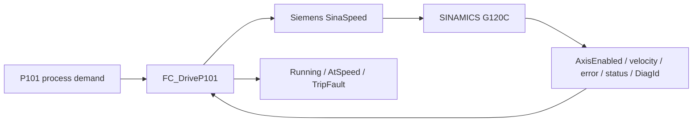
```mermaid
flowchart LR
    P101[P101 process demand] --> FC[FC_DriveP101]
    FC --> SS[Siemens SinaSpeed]
    SS --> G120[SINAMICS G120C]
    G120 --> STAT[AxisEnabled / velocity / error / status / DiagId]
    STAT --> FC
    FC --> DER[Running / AtSpeed / TripFault]
```

<table>
<tr>
<td width="33%">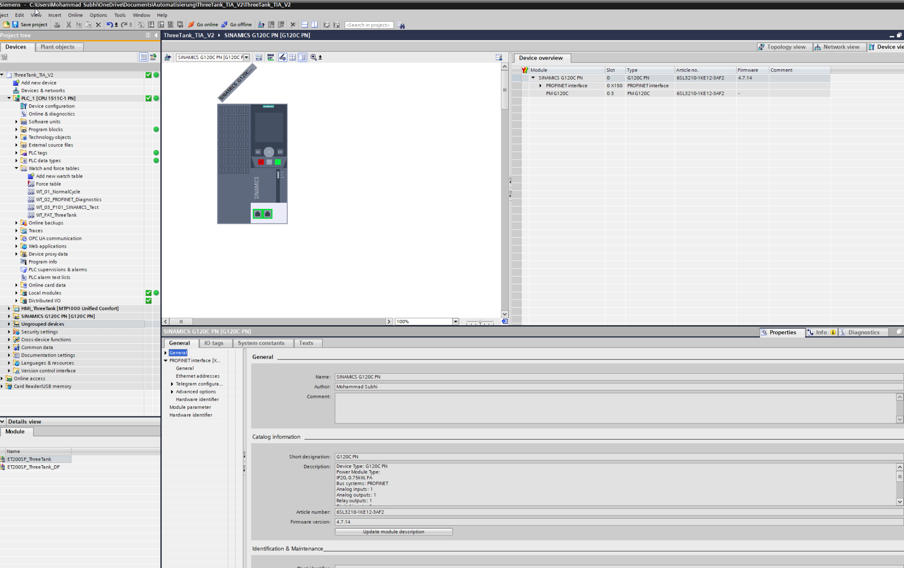</td>
<td width="33%">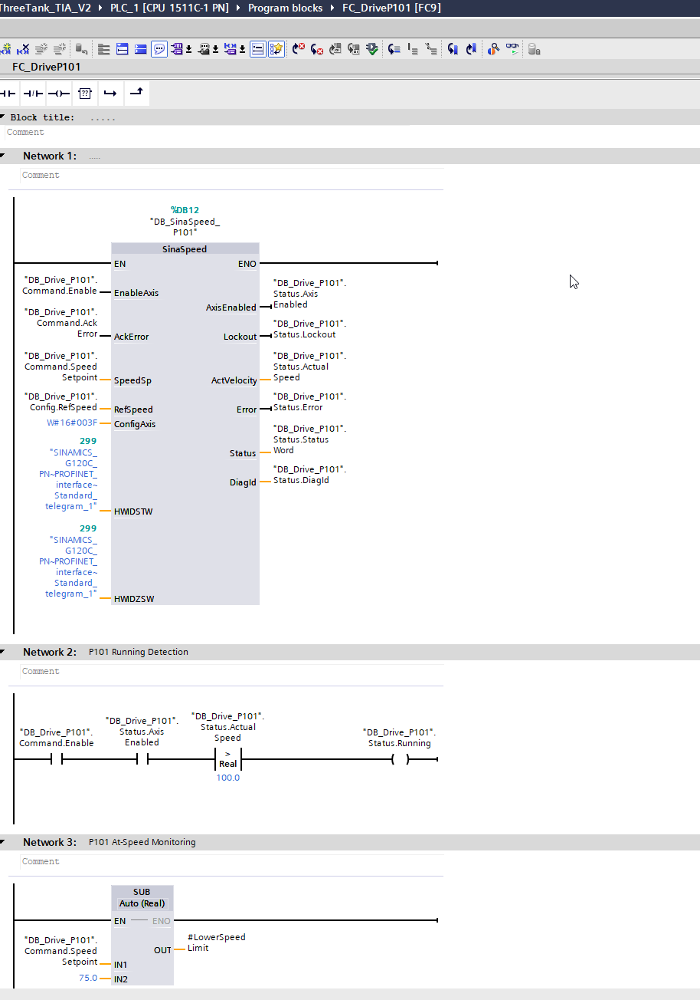</td>
<td width="33%">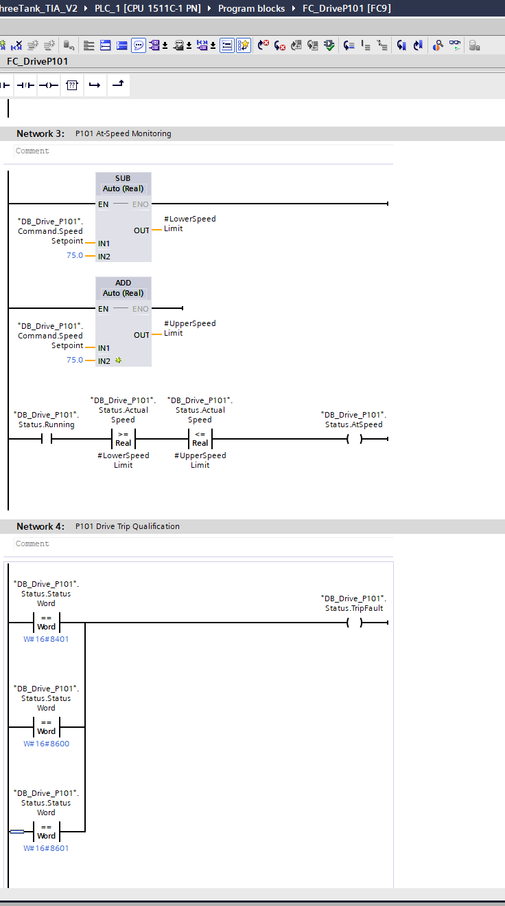</td>
</tr>
</table>

### PROFINET / ET 200SP and PROFIBUS DP

The field-network configuration is kept separate from the process sequence. Hardware addresses are handled through the I/O/data mapping structure, while the controller logic works with structured process data.

| Network | Controller / master | Configured device | Role in the project |
|---|---|---|---|
| PROFINET | CPU 1511C-1 PN | WinCC Unified HMI | operator interface / PLC communication |
| PROFINET | CPU 1511C-1 PN | ET 200SP PN | distributed I/O architecture |
| PROFINET | CPU 1511C-1 PN | SINAMICS G120C PN | P101 drive communication |
| PROFIBUS DP | CM 1542-5 | ET 200SP IM 155-6 DP HF | separate DP remote-I/O architecture |

The PROFINET side also has a defined PLC diagnostic boundary through `FC_PROFINET_Diagnostics [FC8]` and `DB_PROFINET_Diag`; the automatic sequence does not depend on raw network addresses or diagnostic details.

<table>
<tr>
<td width="50%">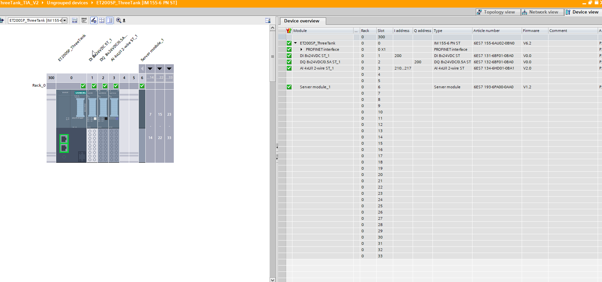</td>
<td width="50%">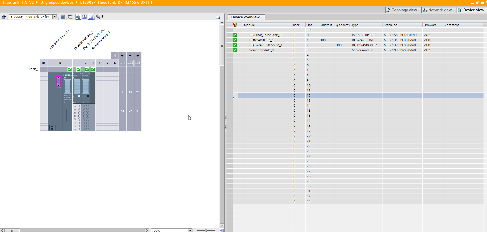</td>
</tr>
</table>

### OPC UA interface

`FC_OPC_UA_Interface [FC7]` copies selected controller information into `DB_OPC_UA`, creating a deliberate supervisory boundary instead of exposing arbitrary internal DB members. The mapping includes tank levels, mode/sequence state, cycle/fault status, alarm/trip information and selected P101 command/status values.

<table>
<tr>
<td width="33%">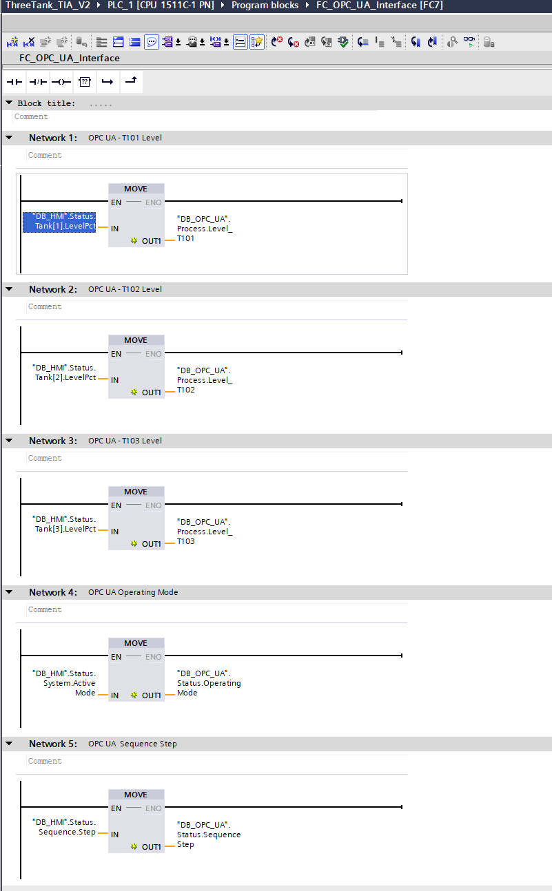</td>
<td width="33%">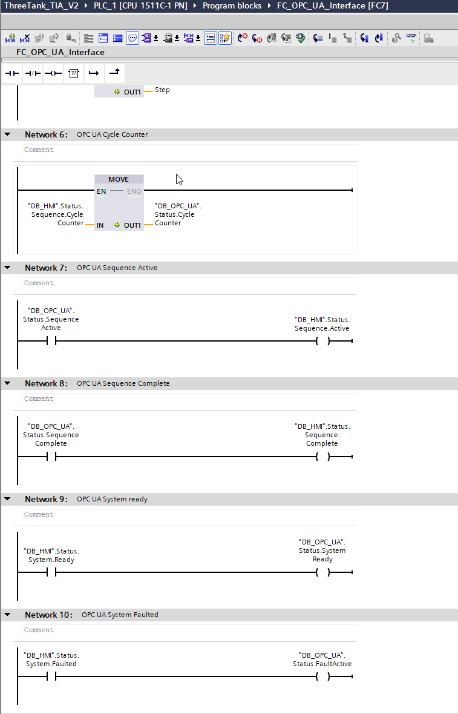</td>
<td width="33%">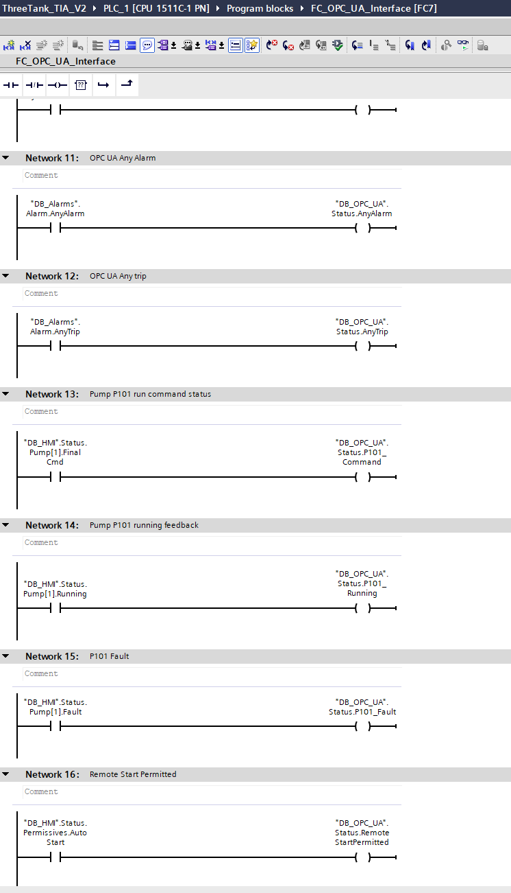</td>
</tr>
</table>

[Drive and networking detail →](docs/DRIVE_AND_NETWORKING.md)

---

<a id="fat"></a>
## 7. FAT validation and traceability

The project was closed with a structured PLCSIM FAT rather than relying on one successful demo cycle. The public package retains **25 test records under their original FAT IDs**, with screenshots tied to the observed PLC/HMI state.

### Coverage

| Area | Retained examples |
|---|---|
| Startup / mode | cold startup, invalid Auto start, valid Auto start |
| Sequence | T101 fill, S40 transfer, S60 cascade, completion |
| Interlocks | XV102→P101, XV103→P102, manual pump interlock |
| Operator action | Stop from multiple active states, manual valve command |
| Device faults | valve feedback failures, P101 RunFb failure, P102 overload |
| Plant safety-chain input | safety-chain trip response and S90 transition |
| Recovery | fault reset/restart, simulation reset behaviour, cycle restart |

### Engineering traceability

| Requirement / feature | Main implementation | Evidence |
|---|---|---|
| XV102 proved before P101 | `FC_PermissiveLogic`, valve/pump FBs | FAT-05, FAT-15, FAT-27 |
| XV103 proved before P102 | `FC_PermissiveLogic`, valve/pump FBs | FAT-08, FAT-16 |
| P101 RunFb supervision | `FB_Pump`, AlarmManager | FAT-17 |
| P102 overload reaction | `FB_Pump`, AlarmManager | FAT-18 |
| Safety-chain trip → controlled fault state | Sequence + AlarmManager | FAT-19 |
| FirstOut retention | `FB_AlarmManager` | FAT-14…FAT-19 evidence |
| Manual commands remain interlocked | Mode/permissive/device path | FAT-26, FAT-27 |
| Controlled restart | Sequence/reset path | FAT-24, FAT-25, FAT-30 |

<p align="center">
  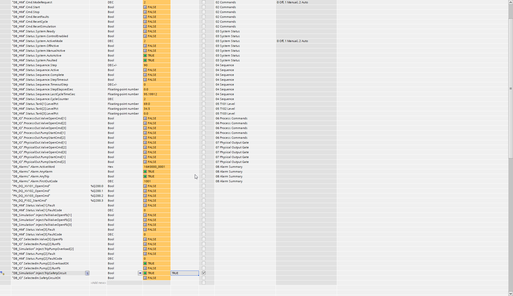
</p>

**Evidence package:** [Screenshot-rich FAT report](docs/ThreeTank_FAT_Validation_Report.pdf) · [FAT index](docs/FAT_VALIDATION.md) · [Engineering traceability matrix](docs/ENGINEERING_TRACEABILITY.md)

---

<a id="archive"></a>
## 8. Project archive and reproduction

The full automatic-cycle recording is linked near the top of this README so the running system is visible before the detailed engineering sections.

### TIA Portal archive

The final `.zap20` engineering archive is distributed as a **GitHub Release asset** rather than stored directly in the repository, keeping the Git history lightweight while preserving the complete TIA Portal project.

**[Download the latest TIA Portal archive from Releases](https://github.com/mohammadHamdan96-Eng/ThreeTank-TIA-Automation/releases/latest)**

Release asset: `ThreeTank_TIA_V2_FINAL_2026-08-29.zap20`

The archive corresponds to the project architecture and retained evidence documented in this repository.

<details>
<summary><strong>PLCSIM startup sequence</strong></summary>

1. Restore/open the `.zap20` project in TIA Portal V20.
2. Compile PLC software and WinCC Unified.
3. Start the supported PLCSIM environment and load the CPU project.
4. Start the WinCC Unified simulation/runtime used for the portfolio tests.
5. Confirm the simulation path and controller health.
6. Select Auto and issue Start from the HMI.
7. Follow `S20 → S40 → S60 → S70` in the HMI, trends or watch table.

Fault-injection variables are test functions for validation and are separate from normal operator process commands.

Full guide: [`docs/RUNNING_IN_PLCSIM.md`](docs/RUNNING_IN_PLCSIM.md)

</details>

<details>
<summary><strong>Repository structure</strong></summary>

```text
ThreeTank-TIA-Automation/
├── README.md
├── .gitignore
├── plc-excerpts/
│   ├── README.md
│   ├── FB_AutoSequence_trip_priority_excerpt.scl
│   └── FB_AlarmManager_firstout_excerpt.scl
├── docs/
│   ├── ARCHITECTURE.md
│   ├── MIGRATION_AND_DESIGN_DECISIONS.md
│   ├── PLC_BLOCK_REFERENCE.md
│   ├── EQUIPMENT_AND_DIAGNOSTICS.md
│   ├── CAUSE_AND_EFFECT_MATRIX.md
│   ├── DRIVE_AND_NETWORKING.md
│   ├── ENGINEERING_TRACEABILITY.md
│   ├── RUNNING_IN_PLCSIM.md
│   ├── FAT_VALIDATION.md
│   ├── ENGINEERING_SCOPE.md
│   └── ThreeTank_FAT_Validation_Report.pdf
├── media/
│   ├── architecture/
│   ├── control/
│   ├── fat/
│   ├── hmi/
│   ├── integration/
│   ├── social-preview.png
│   └── video/
└── project/
    └── README.md  # archive is published through GitHub Releases
```

</details>

---

## Scope boundary

Controller behaviour, WinCC operation, process simulation and FAT were exercised in the portfolio/lab environment. Hardware, network, drive and OPC UA sections document the configured TIA project and PLC-side integration visible in the retained engineering evidence. Physical plant commissioning remains a separate field activity.

The ThreeTank `SafetyCircuitOK` / `TripSafetyCircuit` path is a **simulated standard-PLC plant trip input** used to validate controlled shutdown and diagnostic behaviour. It is not presented as a certified functional-safety function.

---

## Related work

- [ThreeTank CODESYS V1](https://github.com/mohammadHamdan96-Eng/ThreeTank-CODESYS-WaterTransfer) — original process-control baseline before the TIA redesign
- [Elevator-TIA-Safety](https://github.com/mohammadHamdan96-Eng/Elevator-TIA-Safety/tree/main)

## Author

**Mohammad Hamdan**  
Mechatronics Engineer · PLC / Automation Engineering  
[GitHub profile](https://github.com/mohammadHamdan96-Eng)
